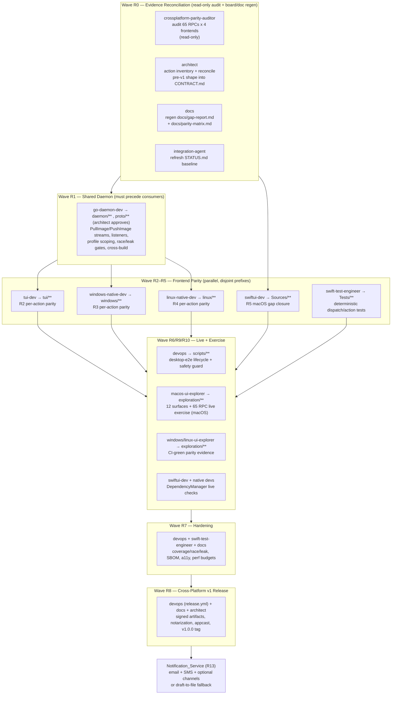
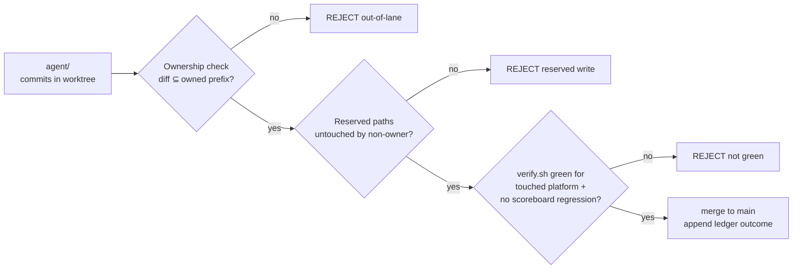
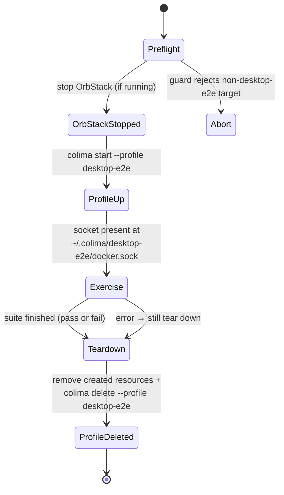

# Design Document

## Overview

The Cross-Platform Live Verification program is an **orchestration and verification design**, not a
new product. Its job is to drive the existing Colima Desktop repository from a partially-verified
`v0.2.0` prerelease to a signed, evidence-backed `v1.0.0`, by:

1. **Auditing** the `.kiro/board` planning documents against real source, tests, and CI evidence
   (roadmap R0).
2. **Completing** the remaining roadmap — shared daemon (R1), per-action parity on TUI (R2),
   Windows (R3), Linux (R4), macOS (R5) — through the existing disjoint-path multi-agent protocol.
3. **Verifying** the product against a **live Colima backend** from an isolated disposable
   `desktop-e2e` profile, exercising every functional surface and all 65 RPCs to the depth defined
   per platform (R6/R9), plus DependencyManager live checks (R10) and quality/security hardening
   (R7).
4. **Shipping** the signed cross-platform `v1.0.0` (R8) and sending a completion notification (R13).

The design consumes two **frozen inputs** and does not redesign either:

- The **Frozen_Contract**: 31 `ColimaService` RPCs + 34 `DockerService` RPCs (65 total), with fixed
  RPC names and proto field numbers. The one permitted change is the *already-approved, pre-v1
  additive request-shape correction* recorded in `INTENT_LEDGER.md` (profile/host/WSL2 scope fields
  on `Update`, `Prune`, `Rename`, `Tag`, `Search`, `NetworkContainer`). The audit **reconciles** this
  into `CONTRACT.md`; it does not invent new shape.
- The **disjoint-path multi-agent ownership model** in `OWNERSHIP.md`, including the append-only
  `INTENT_LEDGER.md` and the single-Integration_Agent merge policy.

The product architecture (ADR-001) also stays fixed: one shared Go/gRPC daemon as the backend brain,
and native frontends per platform (SwiftUI, WinUI 3, GTK4, Bubble Tea). No Electron, no frontend
replacement.

### What this design adds

The net-new engineering in this program is **orchestration and verification machinery**, most of
which lives under `scripts/**` (owned by `devops`) and `exploration/**` (owned by explorer agents):

- A **live test environment lifecycle** (OrbStack shutdown → `desktop-e2e` create/use/teardown) with
  a **profile safety guard** that rejects any action targeting a non-`desktop-e2e` profile.
- A **full-functionality exercise harness** that drives all 12 canonical surfaces and all 65 RPCs on
  macOS against the live backend, including resource creation, and records **ground-truth artifacts**
  with an explicit evidence level.
- A **notification service** with an env-var credential model and a credentials-absent
  draft-to-file + send-script fallback.
- An **evidence taxonomy** and regenerated `docs/gap-report.md` / `docs/parity-matrix.md`, plus a
  requirement-to-verification traceability mapping.
- A **merge gate** that enforces path-scoped ownership, ledger discipline, and the
  `verify.sh` + `frontends.yml` + `test.yml` green requirement before each integration.

## Scope, Constraints, and Preserved Invariants

These are fixed inputs. The design **preserves** each; it does not treat any as a redesign target.

| Invariant | Source | Design treatment |
|-----------|--------|------------------|
| 65 RPC names + counts (31 ColimaService, 34 DockerService) | `CONTRACT.md`, `proto/colima_ui.proto` | Consumed as-is; audited for handler coverage; never renamed/removed. |
| Proto field numbers | `proto/colima_ui.proto` | Preserved. Only the approved pre-v1 additive scope fields already in `INTENT_LEDGER.md` are reflected. |
| Disjoint path ownership | `OWNERSHIP.md` | Every task assigned to exactly one owned prefix; parallel tasks are pairwise disjoint. |
| Append-only `INTENT_LEDGER.md` | `OWNERSHIP.md` protocol | Every task appends an intent entry before and an outcome entry after. Never rewritten. |
| Single Integration_Agent merges to `main` | `OWNERSHIP.md` | Only the Integration_Agent merges; path-scoped checkout enforces ownership. |
| Native-frontend architecture | ADR-001 | SwiftUI/WinUI 3/GTK4/Bubble Tea retained. |
| Practical coverage ceiling (`COV_MIN`, ~71–74%) | `scripts/verify.sh`, ledger ceiling analysis | Kept as the release gate; literal 100% is documented-unreachable headless, not a blocker. |
| fakeDS deterministic tests are regression-only | requirements Constraints | fakeDS proves rendering, never closes live-backend evidence. |

Board files (`.kiro/board/**`), `proto/colima_ui.proto` (single-owner via architect), `README*`,
and `docs/parity-matrix.md`/`docs/truth-table.csv` (architect single-owner) are **reserved to the
orchestrator/architect**, never written by a path-owner agent, to keep coordination conflict-free.

## Architecture

### Program topology

The program runs as a **star of specialist agents around an orchestrator**, with a single
Integration_Agent as the only writer to `main`. Each specialist owns exactly one disjoint path prefix
and communicates coordination facts only through the append-only ledger.

```
                         ┌────────────────────────┐
                         │      Orchestrator       │
                         │  owns .kiro/board/**,   │
                         │  README*, coordinates    │
                         │  waves + reconciliation  │
                         └───────────┬─────────────┘
                                     │ assigns dependency-ordered waves
        ┌───────────────┬───────────┼───────────┬───────────────┬──────────────┐
        ▼               ▼           ▼           ▼               ▼              ▼
 go-daemon-dev     swiftui-dev  windows-    linux-native-  tui-dev      swift-test-
 daemon/** ,       Sources/**   native-dev  dev            tui/**       engineer
 proto/** (propose)             windows/**  linux/**                    Tests/**
        │               │           │           │               │              │
 architect (approves proto) · devops (scripts/**, Makefile, verify.sh, CI) · docs (docs/**, README, .github/**)
 *-ui-explorer (exploration/**) · integration-agent (merges to main)
        └───────────────┴───────────┴───────────┴───────────────┴──────────────┘
                                     │ path-scoped branches
                                     ▼
                         ┌────────────────────────┐
                         │    Integration_Agent    │
                         │  path-scoped checkout,   │
                         │  gate: verify.sh +       │
                         │  frontends.yml + test.yml│
                         │  → merge to main         │
                         └────────────────────────┘
```

The backend/frontend runtime topology is unchanged from ADR-001: frontends are gRPC clients (macOS
additionally uses a native direct-access provider) talking to the shared daemon, which fronts Colima
/ Lima / Docker.

### Execution waves and agent/path ownership

The roadmap is executed in **dependency-ordered waves**. Backend contract work lands before frontend
consumers; frontend parity waves run in parallel because their owned prefixes are disjoint; live
exercise, hardening, and release are strictly downstream.



### Parallelism model

Parallelism is permitted **only** between tasks whose owned path prefixes are pairwise disjoint. The
concrete rules:

- **R0 is a barrier.** The read-only audit and the evidence-taxonomy definition complete first,
  because every downstream task depends on the corrected RPC/action inventory (R0.2) and the honest
  evidence taxonomy (R0.1).
- **R1 precedes R2–R5.** `PullImage`/`PushImage` and the pre-v1 request-shape correction are backend
  changes that frontend consumers depend on (R2.3, R3.3, R4.3). The pre-v1 correction is integrated
  by a single `contract-integration` pass *after* the platform owners that consume it finish, exactly
  as the ledger already records, so no two agents edit the shared proto simultaneously.
- **R2, R3, R4, R5 run fully in parallel.** `tui/**`, `windows/**`, `linux/**`, and `Sources/**` are
  disjoint. `Tests/**` (swift-test-engineer) is disjoint from all of them and runs alongside,
  consuming the macOS interfaces exposed by R5.
- **R6/R9/R10 run after the frontends they exercise land.** macOS live exercise depends on R5;
  Windows/Linux CI-green evidence depends on R3/R4.
- **R7 hardening is downstream of R1–R6.** **R8 release is downstream of R7.** **Notification is
  strictly last**, fired by the release completion.

## Work Decomposition and Agent Assignment

Each roadmap item maps to exactly one owning agent by its disjoint owned prefix. The table is the
authoritative task→agent→prefix→wave assignment.

| Roadmap | Task summary | Owner agent | Owned prefix | Wave |
|---------|--------------|-------------|--------------|------|
| R0.1 | Regenerate gap-report / parity-matrix; kill stale claims | docs (from auditor findings) | `docs/**` | R0 |
| R0.2 | Machine-readable per-frontend 65-RPC action inventory | architect + native agents (read-only) | `exploration/action-inventory.json` (explorer) | R0 |
| R0.3 | Refresh `STATUS.md` baseline from real verify/CI | integration-agent | `.kiro/board/STATUS.md` (orchestrator-reserved) | R0 |
| R0.4 | Close/migrate/delete legacy contradicting docs | architect + docs | `docs/**` | R0 |
| R0.5 | Reconcile pre-v1 additive shape into `CONTRACT.md` | architect | `.kiro/board/CONTRACT.md` (reserved) | R0 |
| R1.1 | `DockerServer.PullImage` real progress stream | go-daemon-dev | `daemon/**` | R1 |
| R1.2 | `DockerServer.PushImage` real progress stream | go-daemon-dev | `daemon/**` | R1 |
| R1.3–R1.5 | Per-RPC integration tests, provider lanes, fault injection | go-daemon-dev + swift-test-engineer + devops | `daemon/**`, `Tests/**`, `scripts/**` | R1 |
| pre-v1 shape | Additive scope fields on Update/Prune/Rename/Tag/Search/NetworkContainer | architect (approve) + go-daemon-dev (propose) | `proto/**` → `daemon/proto/**` | R1 |
| R2.1–R2.11 | TUI per-action parity + live PTY lane | tui-dev | `tui/**` | R2 |
| R3.1–R3.6 | Windows per-action parity + installer | windows-native-dev | `windows/**` | R3 |
| R4.1–R4.7 | Linux per-action parity + packaging | linux-native-dev | `linux/**` | R4 |
| R5.1–R5.5 | macOS gap closure (template UI, orphan view, real progress, config YAML, a11y) | swiftui-dev | `Sources/**` | R5 |
| dispatch tests | Deterministic RPC/profile dispatch tests (macOS) | swift-test-engineer | `Tests/**` | R2–R5 |
| R6.1 | `desktop-e2e` lifecycle + profile safety guard | devops | `scripts/**` | R6 |
| R6.2/R9 | 12-surface + 65-RPC live exercise (macOS); ground-truth capture | macos-ui-explorer | `exploration/**` | R6 |
| R9.5 | Windows/Linux parity via green CI | windows/linux-ui-explorer + devops | `exploration/**`, `.github/**` | R6 |
| R6.3/R10 | DependencyManager live verification | swiftui-dev + native devs | per-frontend prefix | R6 |
| R7.1–R7.5 | Coverage/race/leak, SBOM, a11y, perf budgets | devops + swift-test-engineer + docs | `scripts/**`, `Tests/**`, `docs/**` | R7 |
| R8.1–R8.6 | Cross-platform signed artifacts, notarization, appcast, `v1.0.0` tag | devops + docs + architect | `scripts/**`, `.github/**`, `docs/**` | R8 |
| R13 | Completion notification + fallback | devops | `scripts/**` | post-R8 |

Explorer agents (`exploration/**`) and the read-only auditor never mutate product code; they produce
evidence. The integration-agent never authors feature code; it only merges and refreshes the
scoreboard. This keeps every write path single-owner.

## Conflict-Free Merge Strategy

The coordination mechanism is the existing disjoint-path model, made concrete for parallel execution.

### Isolated git worktrees per agent branch

Each specialist runs in its **own git worktree** on a branch `agent/<name>` cut from the current
`main` HEAD, so agents never share a working tree and never block each other:

```bash
# One worktree per agent, off the same base commit.
git worktree add ../cd-agents/<name> -b agent/<name> <base-sha>
# The agent works ONLY inside its worktree and commits ONLY to agent/<name>.
# No agent pushes; no agent merges to main.
```

This mirrors the pattern already recorded in the ledger (2026-07-16 "each in an ISOLATED git
worktree on branch `agent/<name>` … scoped to a disjoint OWNERSHIP path").

### Path-scoped checkout at integration

The Integration_Agent does **not** perform full-branch merges. It harvests only the owner's prefix,
so a stray write an agent may have made outside its lane is discarded and history stays
orchestrator-controlled:

```bash
# Harvest ONLY the owned prefix from the agent branch.
git checkout agent/<name> -- <owned-prefix>
# Verify nothing outside the prefix was staged:
git diff --cached --name-only | grep -vE '^<owned-prefix>' && { echo "REJECT: out-of-lane write"; exit 1; }
```

### Append-only INTENT_LEDGER discipline

Every task brackets its work with two ledger entries (never rewriting prior entries):

- **Before:** `intent`, `plan`, `files-to-touch` (all inside the owned prefix).
- **After:** `outcome` (evidence) and `contract-impact`.

The ledger is the single source of coordination truth; the "files-to-touch" list is the declared
lane and is checked against the actual diff at integration.

### Single Integration_Agent gate

Only the Integration_Agent merges to `main`. Before each merge it enforces, in order:

1. **Ownership check** — the harvested diff touches only the owner's prefix (path-scoped checkout
   above). Any out-of-lane path → **reject**.
2. **Reserved-path check** — `.kiro/board/**`, `proto/colima_ui.proto`, `README*`, and
   `docs/parity-matrix.md`/`docs/truth-table.csv` were not modified by a non-owner. Proto changes are
   accepted only from the architect-approved `contract-integration` pass.
3. **Green gate** — `scripts/verify.sh` passes for the touched platform, **and** the change holds or
   improves every other platform's `STATUS.md` scoreboard value (the `OWNERSHIP.md` pre-merge rule).
4. **CI gate for release candidates** — all 9 `frontends.yml` jobs and `test.yml` are green before an
   R8 release candidate is cut.



### Reserved-to-orchestrator paths

To eliminate the most contended files, these are never in any specialist's lane:

- `.kiro/board/**` (PLAN, STATUS, CONTRACT, OWNERSHIP, INTENT_LEDGER header, DECISIONS)
- `proto/colima_ui.proto` (architect single-owner; go-daemon-dev proposes)
- `README*`, `docs/parity-matrix.md`, `docs/truth-table.csv` (architect/orchestrator)

## Live Test Environment Design (R6.1 / R8)

Live real-backend verification is confined to a **disposable, safety-prefixed** Colima profile named
`desktop-e2e`, with OrbStack stopped so no existing user data is touched (Assumption A3).

### Environment lifecycle



Concretely, a `scripts/live/e2e-env.sh` (owned by `devops`) provides `up`, `down`, and `guard`
subcommands:

```bash
#!/usr/bin/env bash
# scripts/live/e2e-env.sh — disposable live-backend lifecycle. desktop-e2e ONLY.
set -euo pipefail
E2E_PROFILE="desktop-e2e"
SOCK="$HOME/.colima/${E2E_PROFILE}/docker.sock"

up() {
  # 1. Stop OrbStack so its socket/context never intercepts live tests (A3).
  osascript -e 'quit app "OrbStack"' 2>/dev/null || pkill -x OrbStack 2>/dev/null || true
  # 2. Start the disposable profile only.
  colima start --profile "$E2E_PROFILE"
  # 3. Gate on the profile-scoped socket, never the default docker.sock.
  for _ in $(seq 1 60); do [ -S "$SOCK" ] && return 0; sleep 2; done
  echo "desktop-e2e socket never appeared" >&2; return 1
}

down() {
  # Best-effort resource cleanup, then delete the whole profile (idempotent).
  DOCKER_HOST="unix://$SOCK" docker rm -f $(DOCKER_HOST="unix://$SOCK" docker ps -aq) 2>/dev/null || true
  colima delete --profile "$E2E_PROFILE" --force 2>/dev/null || true
}
```

### Profile safety guard (hard invariant)

Every live action passes through a guard that **rejects any target profile other than
`desktop-e2e`**. This is the single most important safety property of the program; it is enforced in
one place and reused by the harness, the daemon test env, and `verify.sh`:

```bash
guard() {  # usage: guard "<profile>"  — exit 0 only for the disposable profile
  local target="${1:-}"
  if [ "$target" != "$E2E_PROFILE" ]; then
    echo "SAFETY: refusing live action against profile '$target' (only $E2E_PROFILE allowed)" >&2
    return 1
  fi
}
```

The macOS RealBackend test lane already honors this: it activates only when
`~/.colima/desktop-e2e/docker.sock` is present and runs with
`TEST_RUNNER_COLIMA_DESKTOP_TEST_PROFILE=desktop-e2e` (see `verify.sh` and the `test-real-e2e`
Make target). The guard makes the constraint explicit and testable.

### Test project layout

The live test project and all created evidence live under `/Volumes/Projects/` (R8.3):

```
/Volumes/Projects/
  colima-desktop/                      # the repo under test
  cd-agents/<name>/                    # per-agent isolated worktrees
  cd-live/                             # disposable live workspace (git-ignored)
    fixtures/                          # tiny build contexts (Dockerfile, compose) for create tests
    artifacts/                         # transient run logs (never committed with secrets)
```

Only sanitized, secret-free evidence is copied into `exploration/**`; raw run logs under
`cd-live/artifacts/` are transient and git-ignored (R8.6 / R6 global gate).

### Platform depth (Assumption A2)

- **macOS** gets **local live evidence** against `desktop-e2e`: the SwiftUI app and the RealBackend
  test lane exercise real RPCs, real Docker data, and real resource creation.
- **Windows and Linux** prove parity through **green CI** (`frontends.yml` 9 jobs + `test.yml`),
  because live UIA and AT-SPI capture are environment-blocked on a macOS-only host. Their evidence
  level is therefore capped at `CI-without-daemon`, recorded honestly (see Evidence & Traceability).

## Full-Functionality Exercise Design (R9)

On macOS, the app must drive **all 12 canonical surfaces** and **all 65 RPCs** against the live
`desktop-e2e` backend, including **creating** containers, images (pull), volumes, networks, and VMs.

### Canonical surfaces and RPC coverage

The 12 canonical surfaces map to RPC groups as follows (drawn from `CONTRACT.md` Parts A+B):

| # | Canonical surface | RPC groups exercised |
|---|-------------------|----------------------|
| 1 | Dashboard | VM `Status`/`Version`/`Start`/`Stop`/`Restart` |
| 2 | Containers | `DockerService` container ops incl. `create`, `start`, `stop`, `remove`, `logs`, `stats` |
| 3 | Images | `list`, **`pull`**, `push`, `remove`, `tag`, `inspect`, `history`, `prune` |
| 4 | Volumes | `list`, **`create`**, `remove`, `inspect`, `prune` |
| 5 | Networks | `list`, **`create`**, `remove`, `inspect`, `connect`, `disconnect`, `prune` |
| 6 | Profiles | `ListProfiles`, `CreateProfile`, `DeleteProfile`, `CloneProfile` |
| 7 | Config | `GetConfig`, `SetConfig` |
| 8 | Template | `GetTemplate`, `SetTemplate` |
| 9 | Kubernetes | `KubernetesStart`/`Stop`/`Reset`/`Exec` |
| 10 | AI Workloads | `ModelSetup`/`ModelRun`/`ModelServe`/`ModelStop` |
| 11 | Runtime | `SwitchRuntime`, `UpdateRuntime` |
| 12 | Monitoring | `VMStats`, `ProcessList`, `KillProcess`; `SSHConfig`, `ListMachines`, `Update`, `Prune` |

The harness drives these through the SwiftUI app under `--ui-testing`-off (real provider) using the
XCUITest lane plus the RealBackend service lane, so each surface issues real profile-scoped calls to
`desktop-e2e` and asserts real backend data returns without a crash (R9.4).

### Resource creation flow (R9.2)

The creation sequence is ordered to be self-contained and fully torn down:

```
pull image (alpine:latest) → create volume (e2e-vol) → create network (e2e-net)
  → create container (e2e-ctr on e2e-net, mounting e2e-vol) → start → assert running
  → stream logs/stats briefly → stop → remove container → remove network/volume → remove image
```

Every created resource carries an `e2e-` name prefix so teardown can find and remove exactly what the
run created, and the profile guard guarantees it all happens inside `desktop-e2e`.

### Ground-truth artifacts and evidence levels

Each exercised action appends a record to a per-platform ground-truth artifact under
`exploration/<platform>/ground-truth.json`, labeled with its evidence level (see taxonomy below).
The existing `exploration/action-inventory.json` already carries the real per-frontend handler counts
(macOS 63, Windows 65, Linux 65, TUI 61) and honest evidence-semantics fields; the harness updates the
`native_ui_live_backend` field for each macOS action it actually exercises, and leaves
`environment-blocked` where UIA/AT-SPI capture cannot run (R9.7).

## Notification Service Design (R13)

The Notification_Service sends a completion summary when `v1.0.0` finishes. It is a `devops`-owned
script under `scripts/**` (e.g. `scripts/notify/notify.sh` + `scripts/notify/render.py`), invoked as
the final release step.

### Credential model (env-var only)

All credentials come from environment variables; none are stored in the repo (Assumption A1, R13.3).
The service reads a provider set and picks whichever is configured:

| Channel | Env vars (examples) | Provider |
|---------|---------------------|----------|
| Email | `SMTP_HOST`, `SMTP_PORT`, `SMTP_USER`, `SMTP_PASS` **or** `SENDGRID_API_KEY` | SMTP or SendGrid |
| SMS | `TWILIO_ACCOUNT_SID`, `TWILIO_AUTH_TOKEN`, `TWILIO_FROM` **or** equivalent | Twilio or equivalent |
| WhatsApp (optional) | `TWILIO_WHATSAPP_FROM` or provider key | Twilio or equivalent |
| Telegram (optional) | `TELEGRAM_BOT_TOKEN`, `TELEGRAM_CHAT_ID` | Telegram Bot API |
| Viber (optional) | `VIBER_AUTH_TOKEN` | Viber |

Fixed recipients (from the requirements): email → `jusys.linas@gmail.com`, SMS → `+37060891909`.

### Message content

The rendered summary contains the released version, the completed roadmap item identifiers, and the
final verification result (R13.1/R13.2):

```
Subject: Colima Desktop v1.0.0 released
Body:
  Version:  v1.0.0
  Roadmap:  R0, R1, R2, R3, R4, R5, R6, R7, R8 completed
  Verify:   RESULT: GREEN (coverage 74.2%, frontends.yml 9/9, test.yml pass)
  Notes:    <release notes URL / tag URL>
```

SMS is the compact variant: version + final verify result only.

### Credentials-absent fallback (R13.4)

If a channel's credentials are absent, the service does **not** fail the release. It writes the
drafted content to a file and emits a re-runnable send script:

```
dist/notifications/
  v1.0.0-email.txt        # rendered email (subject + body)
  v1.0.0-sms.txt          # rendered SMS
  send-notifications.sh   # re-run once creds are exported in the environment
```

```python
# scripts/notify/render.py (sketch) — channel selection + fallback
def deliver(channel, payload, env):
    creds = load_creds(channel, env)          # reads only from environment
    if not creds.complete():
        draft_path = write_draft(channel, payload)     # dist/notifications/*.txt
        ensure_send_script(channel)                    # send-notifications.sh
        return Result(status="drafted", path=draft_path)
    return send(channel, payload, creds)               # SMTP/SendGrid/Twilio/Telegram/Viber
```

### Secret hygiene (R13.6)

Credentials never appear in message bodies, logs, artifacts, or the drafted files. The renderer
operates on a payload that structurally excludes secrets, and the sender logs only channel + status +
recipient (never tokens). A pre-send scrub asserts no known secret substring appears in the rendered
output before it is written or transmitted.

## Evidence and Traceability (R0, R9)

### Evidence-level taxonomy

Every capability claim is labeled with exactly one evidence level, ordered weakest → strongest:

| Level | Meaning | Typical source |
|-------|---------|----------------|
| `source-only` | A concrete method/handler exists in source | audit of daemon/frontend code |
| `deterministic-fake-data` | Renders/behaves correctly against fakeDS fixtures | unit/integration/snapshot tests |
| `CI-without-daemon` | Compiles and passes tests on a native runner without a live daemon | `frontends.yml`, `test.yml` |
| `live-backend` | Verified against a live Colima daemon (`desktop-e2e`) | macOS RealBackend lane, live exercise |
| `environment-blocked` | Capture could not run in this environment (recorded, never faked) | UIA/AT-SPI on macOS-only host |

`live-backend` is the only level that closes a live-verification obligation. `deterministic-fake-data`
never closes one (requirements Constraints). `environment-blocked` is an honest terminal label, not a
pass.

### gap-report and parity-matrix regeneration

`docs/gap-report.md` and `docs/parity-matrix.md` are **regenerated from source**, not hand-edited, so
they cannot drift:

```
proto/colima_ui.proto ─┐
daemon server methods ─┼─► scripts/gen-truth-table.py ─► docs/truth-table.csv
frontend handlers ─────┘                                     │
exploration/action-inventory.json ──────────────────────────┼─► docs/gap-report.md
                                                             └─► docs/parity-matrix.md (architect)
```

The generator distinguishes the four positive evidence levels per RPC×frontend cell, replacing the
stale "no pull/push RPC" and "config/template unimplemented" claims called out in `PLAN.md`.

### Requirement → verification mapping

| Requirement | Primary verification | Evidence level target |
|-------------|----------------------|-----------------------|
| R1 Board audit | Regenerated gap-report/parity-matrix diffed against source; STATUS refreshed | source-only → live-backend labels |
| R2 Multi-agent protocol | Merge-gate ownership + ledger checks (property tests on the gate) | n/a (process) |
| R3 Daemon completion | `go test`, `go test -race`, bufconn per-RPC, cross-build | CI-without-daemon + live read-only |
| R4 TUI parity | teatest dispatch tests + live PTY lane on `desktop-e2e` | deterministic → live-backend |
| R5 Windows parity | Headless view-model tests + green `windows-winui` CI | CI-without-daemon |
| R6 Linux parity | Rust unit/clippy/fmt + green `linux-gtk4` CI | CI-without-daemon |
| R7 macOS gaps | ViewInspector/unit tests + XCUITest + RealBackend lane | deterministic → live-backend |
| R8 Live env | `desktop-e2e` lifecycle + guard tests | live-backend |
| R9 Full exercise | XCUITest + RealBackend 12-surface/65-RPC run; ground-truth artifacts | live-backend (macOS) / CI (Win/Linux) |
| R10 DependencyManager | Per-platform state + cancel/offline/permission tests | deterministic + live |
| R11 Hardening | `verify.sh` GREEN, race/leak, SBOM, a11y, perf budgets | CI + live |
| R12 Release | `release.yml` signed artifacts + `v1.0.0` tag gates | CI |
| R13 Notification | Renderer/fallback/secret-scrub tests | deterministic |

## Components and Interfaces

The net-new program components (all inside owned prefixes) expose these interfaces. Cross-language
contracts are shown as **Structured Pseudocode**; scripts are shown in their real language (Bash/
Python), since `scripts/**` is the owning prefix.

### Profile safety guard — `scripts/live/e2e-env.sh`

```
guard(profile: string) -> exit 0 iff profile == "desktop-e2e", else exit 1 + stderr reason
up() -> stops OrbStack, starts desktop-e2e, blocks until profile socket exists
down() -> removes e2e- resources, deletes desktop-e2e profile (idempotent)
```

### Live exercise harness — macOS (XCUITest + RealBackend lane)

```
ExerciseHarness:
  run_all_surfaces(profile) -> [SurfaceResult]   # 12 canonical surfaces
  run_all_rpcs(profile)     -> [RpcResult]       # 65 RPCs
  create_resources(profile) -> CreationResult    # image/volume/network/container/VM
  record(action, evidence_level) -> appends GroundTruthRecord
  # precondition: guard(profile) must pass; profile is always "desktop-e2e"
```

### Merge gate — `scripts/ci/merge-gate.sh`

```
check_ownership(branch, owned_prefix) -> ok | reject(out_of_lane_paths)
check_reserved(diff) -> ok | reject(reserved_paths_touched)
check_green(platform) -> ok | reject   # verify.sh green + no STATUS regression
gate(branch, owned_prefix, platform) -> merge to main | reject with reason
```

### Notification service — `scripts/notify/`

```
render(summary: {version, roadmap_ids[], verify_result, notes_url}) -> {email, sms}
deliver(channel, payload, env) -> Result{status: sent|drafted, path?}
scrub(text, known_secrets[]) -> assert no secret substring present
```

### Evidence generator — `scripts/gen-truth-table.py` (existing, extended)

```
build_matrix(proto, server_methods, frontend_handlers, action_inventory)
  -> rows[RpcFrontendCell{rpc, frontend, evidence_level}]
emit(truth_table.csv, gap_report.md)   # parity-matrix.md is architect-owned
```

## Data Models

### GroundTruthRecord (per exercised action)

```
GroundTruthRecord:
  id: string                  # e.g. "DockerService.CreateContainer:macos"
  service: "ColimaService" | "DockerService"
  rpc: string
  surface: string             # one of 12 canonical surfaces
  frontend: "macos"|"windows"|"linux"|"tui"
  evidence_level: "source-only"|"deterministic-fake-data"|"CI-without-daemon"|"live-backend"|"environment-blocked"
  observed: bool              # real backend data returned
  created_resource: bool      # true for create-* actions
  limitation: string          # honest boundary; empty when fully proven
```

This matches the shape already used in `exploration/action-inventory.json` (which carries the
per-frontend handler counts and evidence-semantics fields), extended with an explicit
`evidence_level`.

### NotificationPayload

```
NotificationPayload:
  version: string             # "v1.0.0"
  roadmap_ids: [string]       # ["R0".."R8"]
  verify_result: string       # "RESULT: GREEN (coverage 74.2%, ...)"
  notes_url: string
  # NOTE: no credential/secret field exists on this type by construction (R13.6)
```

### EvidenceCell (parity matrix row)

```
EvidenceCell:
  rpc: string                 # one of the 65
  frontend: "macos"|"windows"|"linux"|"tui"
  server_implemented: bool
  frontend_handler: bool
  evidence_level: <taxonomy>
```

## Error Handling

The design's risky flows each have an explicit, safe failure path.

### Destructive live tests

- **Wrong-profile target:** the guard rejects any profile other than `desktop-e2e` *before* any
  destructive call; the action never reaches Docker/Colima. This is a hard invariant, enforced once
  and reused everywhere.
- **Teardown on failure:** the lifecycle runs `down()` even when the suite fails (state machine
  `Exercise → Teardown` on error), so a failed run never leaves `desktop-e2e` resources behind.
- **OrbStack still running:** `up()` stops OrbStack first; if it cannot, it still gates on the
  `desktop-e2e`-scoped socket path, never the default `docker.sock`, so live tests cannot bind to the
  user's real environment.
- **Socket never appears:** `up()` times out with a clear error and the run aborts before exercising.

### Missing credentials (notification)

- Any absent channel credential triggers the **draft-to-file + send-script** fallback rather than
  failing the release (R13.4). The release is considered complete; delivery is deferred.
- A partially configured channel (e.g. SMTP host but no password) is treated as absent for that
  channel and also falls back, so half-set credentials never cause a broken send.

### Environment-blocked captures

- Windows UIA and Linux AT-SPI capture on a macOS-only host are labeled `environment-blocked` in the
  ground-truth artifact (R9.7), never fabricated as success. Parity for those platforms is instead
  asserted via green CI, and the evidence level is honestly capped at `CI-without-daemon`.

### Merge-gate rejections

- Out-of-lane writes, reserved-path writes by non-owners, and non-green states each produce a
  rejection with a specific reason and leave `main` untouched. The agent fixes and re-submits; the
  ledger records both attempts.

### Daemon request scoping

- A profile/provider-sensitive request that lacks the required scope field is **rejected with a
  contextual error** rather than silently targeting global state (R3.5; already implemented per the
  ledger for Update/Prune/Rename/Tag/Search/NetworkContainer via the pre-v1 shape correction).
- Streamed operations (`PullImage`/`PushImage`, event/log/stat streams) propagate cancellation and
  errors to the client and must not leak goroutines (verified by `go test -race`).

## Testing Strategy

The program reuses the existing, proven test infrastructure — the 3-layer macOS pyramid, XCUITest,
the gated real-e2e lane, the Go daemon/TUI lanes, and the native-frontend CI lanes — rather than
introducing new frameworks.

### Existing lanes reused

| Lane | Target / command | Purpose in this program |
|------|------------------|-------------------------|
| Unit (Swift Testing) | `ColimaDesktopUnitTests` / `make test-unit` | AppState, validation, models, service construction, property tests |
| Integration (ViewInspector) | `ColimaDesktopIntegrationTests` / `make test-integration` | View bindings/navigation for R5 gap closure |
| Snapshot | `ColimaDesktopSnapshotTests` / `make test-snapshots` | Visual regression for critical macOS surfaces (R5.4) |
| XCUITest E2E | `ColimaDesktopUITests` / `make test-ui` | Drives 12 canonical surfaces for the R9 exercise |
| Real-backend E2E | `RealBackendTests` / `make test-real-e2e` (gated by `desktop-e2e` socket) | Live-backend evidence on macOS (R8/R9) |
| Daemon | `go test ./...`, `go test -race ./...`, bufconn | Per-RPC + race/leak/cancellation (R1/R7) |
| TUI | teatest golden + dispatch tests | Deterministic action→RPC mapping (R2.7) |
| Windows | headless view-model tests + `windows-winui` CI | R3 parity (CI-without-daemon) |
| Linux | Rust unit + clippy `-D warnings` + `linux-gtk4` CI | R4 parity (CI-without-daemon) |
| Scoreboard | `scripts/verify.sh` → `STATUS.md` | Merge gate + release gate |
| CI gates | `frontends.yml` (9 jobs) + `test.yml` | Release-candidate gate (R11.6) |

### Test categories for the net-new components

- **Property tests (Swift Testing / Go / Python)** for the pure, input-varying logic: the profile
  safety guard, the merge-gate ownership check, evidence-level assignment, notification rendering +
  fallback + secret scrub, DependencyManager state classification, and daemon request scoping. Minimum
  100 iterations per property (randomized), each tagged to its design property.
- **Example/edge-case unit tests** for concrete flows: cancellation of a dependency install, offline
  dependency check, permission-denied install, orphaned create-container view resolution.
- **Integration/live tests** for the live-backend obligations (12 surfaces, 65 RPCs, resource
  creation) on `desktop-e2e`, and CI-green parity for Windows/Linux.
- **Smoke tests** for one-shot configuration: release signing/notarization config, non-placeholder
  Sparkle key, CI job presence.

### Property test configuration

- Minimum **100 iterations** per property test (randomized inputs).
- Each property test references its design property via tag
  `Feature: cross-platform-live-verification, Property {n}: {text}`.
- Property tests that touch the live backend use the guard + `desktop-e2e` and never a modal
  (`NSSavePanel`/`NSOpenPanel`/`runModal`) — per the documented headless-hang lesson in the ledger.

### Dual testing approach

Unit/example tests cover specific behaviors and edge cases; property tests cover universal invariants
across generated inputs. Both are required. Property tests are favored for parsers/serializers
(evidence CSV round-trip, notification render), invariants (guard, evidence taxonomy totality), and
error conditions (bad profile, missing credentials, unscoped requests).

## Correctness Properties

*A property is a characteristic or behavior that should hold true across all valid executions of a
system — essentially, a formal statement about what the system should do. Properties serve as the
bridge between human-readable specifications and machine-verifiable correctness guarantees.*

The properties below were derived from the prework classification and consolidated to remove
redundancy. Each is universally quantified and annotated with the requirements it validates. Process,
integration, smoke, and edge-case criteria are covered by the Testing Strategy lanes rather than by
these properties.

### Property 1: Profile safety guard

*For any* profile name, the live-test guard permits the action if and only if the name equals
`desktop-e2e`; every other profile name is rejected before any Colima or Docker call is issued.

**Validates: Requirements 8.2, 8.5**

### Property 2: Live resource create/teardown round-trip

*For any* set of `e2e-`-prefixed resources created during a live suite, running teardown (including
after a suite failure) leaves none of those resources present in the `desktop-e2e` profile.

**Validates: Requirements 8.4**

### Property 3: Merge-gate ownership rejection

*For any* agent and *any* changeset, the Integration_Agent gate rejects the merge if the changeset
touches a path outside the agent's owned prefix, and permits it (ownership-wise) only when every
changed path is under that prefix.

**Validates: Requirements 2.7**

### Property 4: Merge-gate green / no-regression decision

*For any* candidate merge, the gate accepts it only when `verify.sh` is green for the touched platform
and no other platform's `STATUS.md` scoreboard value regresses; otherwise it rejects.

**Validates: Requirements 2.8**

### Property 5: Path-ownership disjointness

*For any* two distinct owned path prefixes in the ownership model, and *for any* two tasks scheduled to
run in parallel, their owned prefixes do not overlap.

**Validates: Requirements 2.2, 2.3**

### Property 6: Frozen-contract preservation

*For any* integrated state of the proto, the declared RPC set contains exactly 31 `ColimaService` and
34 `DockerService` RPCs with unchanged names and field numbers, except for the approved pre-v1
additive scope fields recorded in `INTENT_LEDGER.md`.

**Validates: Requirements 2.1**

### Property 7: Contract coverage

*For all* 65 Frozen_Contract RPCs, a concrete (non-`Unimplemented`) daemon server method exists, and
*for every* (RPC, frontend) pair the audit produces exactly one coverage cell.

**Validates: Requirements 3.1, 1.1, 5.1, 6.1**

### Property 8: Evidence-level totality and environment-blocked labeling

*For every* capability claim and *every* exercised-action record, exactly one evidence level from the
taxonomy {source-only, deterministic-fake-data, CI-without-daemon, live-backend, environment-blocked}
is assigned; and *for any* UIA/AT-SPI capture that cannot run, the assigned level is exactly
`environment-blocked` (never a success level).

**Validates: Requirements 1.2, 1.8, 9.6, 9.7**

### Property 9: Documentation regeneration idempotence and coverage

*For any* source snapshot (proto + server methods + frontend handlers), regenerating
`docs/gap-report.md` / `docs/parity-matrix.md` twice yields byte-identical output, and every RPC
declared in the proto appears at least once in the regenerated report.

**Validates: Requirements 1.6**

### Property 10: Profile-scoped command targeting

*For any* profile-scoped request carrying profile `P`, the command the daemon constructs targets
profile `P` and never a default or globally-scoped target.

**Validates: Requirements 3.4**

### Property 11: Unscoped-request rejection

*For any* request that omits a profile or provider field required for safe scoping, the daemon rejects
the request with a contextual error rather than executing against global state.

**Validates: Requirements 3.5**

### Property 12: Action-to-RPC dispatch mapping

*For any* advertised frontend action (TUI, Windows, or Linux), dispatching that action invokes exactly
the Frozen_Contract RPC the action maps to, scoped to the active profile.

**Validates: Requirements 4.1, 4.2, 4.3, 4.7, 5.2, 5.3, 5.4, 6.2, 6.3, 6.4**

### Property 13: Destructive-action confirmation gate

*For any* destructive action on any frontend, no RPC is invoked unless an explicit confirmation has
been given; denying or dismissing the confirmation issues no RPC.

**Validates: Requirements 4.4, 5.5, 6.6, 7.2**

### Property 14: Bounded streamed output

*For any* streamed action and *any* length of backend output, the number of displayed output lines
never exceeds the configured display bound.

**Validates: Requirements 4.5**

### Property 15: Error rendering with context

*For any* RPC that returns an error, the frontend's rendered state for that action contains the error
with contextual information rather than silently succeeding.

**Validates: Requirements 4.6**

### Property 16: Non-reentrant busy state

*For any* command already in its busy (in-flight) state, a concurrent invocation of the same command is
blocked until the first completes or is cancelled.

**Validates: Requirements 5.6**

### Property 17: Accessibility identifier totality and uniqueness

*For all* interactive controls across the Desktop_Frontends, each control has a non-empty accessibility
identifier and no identifier collides with another control on the same surface.

**Validates: Requirements 5.7, 11.4**

### Property 18: Template read/save round-trip

*For any* template content, saving it through `SetTemplate` and then reading it through `GetTemplate`
returns content equivalent to what was saved.

**Validates: Requirements 7.1**

### Property 19: Configuration unknown-key preservation

*For any* profile configuration YAML, loading it into the macOS config model and saving it back
preserves every unknown key and every known value present in the original.

**Validates: Requirements 7.4**

### Property 20: DependencyManager state totality

*For any* host state, the dependency check assigns each of the six tracked tools (`colima`, `lima`,
`qemu`, `krunkit`, `docker-cli`, `kubectl`) exactly one state among installed, missing, and outdated.

**Validates: Requirements 10.1**

### Property 21: Missing-dependency install-path offer

*For any* dependency reported as missing, the DependencyManager offers an install path through the
platform package manager or a signed direct download.

**Validates: Requirements 10.2**

### Property 22: Release P0/P1 blocking

*For any* set of open defects, the release gate blocks the `v1.0.0` tag if and only if the set contains
at least one defect with priority P0 or P1.

**Validates: Requirements 12.5**

### Property 23: Notification rendering completeness

*For any* completion summary, the rendered email contains the released version, all completed roadmap
item identifiers, and the final verification result; and the rendered SMS contains the released
version and the final verification result.

**Validates: Requirements 13.1, 13.2**

### Property 24: Notification credentials-absent fallback

*For any* subset of absent email/SMS credentials, the Notification_Service writes the drafted message
content to a file and provides a send script, and does not fail the release for the affected channel.

**Validates: Requirements 13.4**

### Property 25: Secret hygiene invariant

*For any* rendered notification message, *any* emitted log line, and *any* committed evidence artifact,
no credential or secret substring is present.

**Validates: Requirements 8.6, 13.6**

## Design Complete

This design is complete. It reflects the real repository state: the frozen v1 contract (31
`ColimaService` + 34 `DockerService` RPCs) and the disjoint-path multi-agent ownership model are
treated as fixed constraints, not redesign targets; the net-new machinery (live `desktop-e2e`
lifecycle + safety guard, full-functionality exercise harness, notification service with
draft-to-file fallback, evidence taxonomy, and merge gate) lives inside the existing owned prefixes
and reuses the established 3-layer pyramid, XCUITest, real-e2e, and CI lanes.

The next phase is **Tasks** — decomposing this design into dependency-ordered, agent-assigned
implementation tasks that follow the R0 → R1 → R2/R3/R4/R5 → R6 → R7 → R8 → notification wave order.
